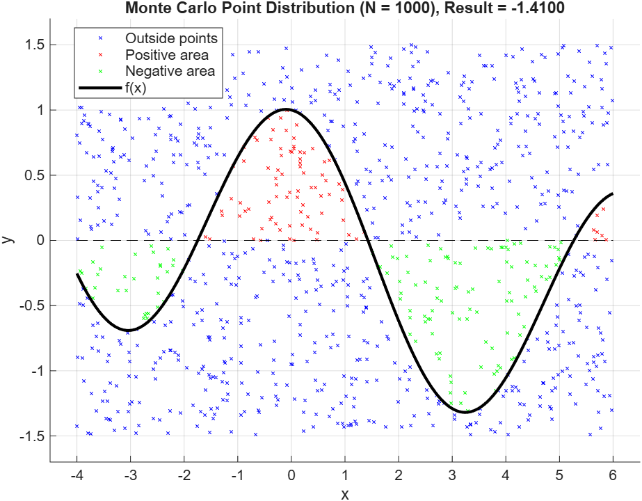
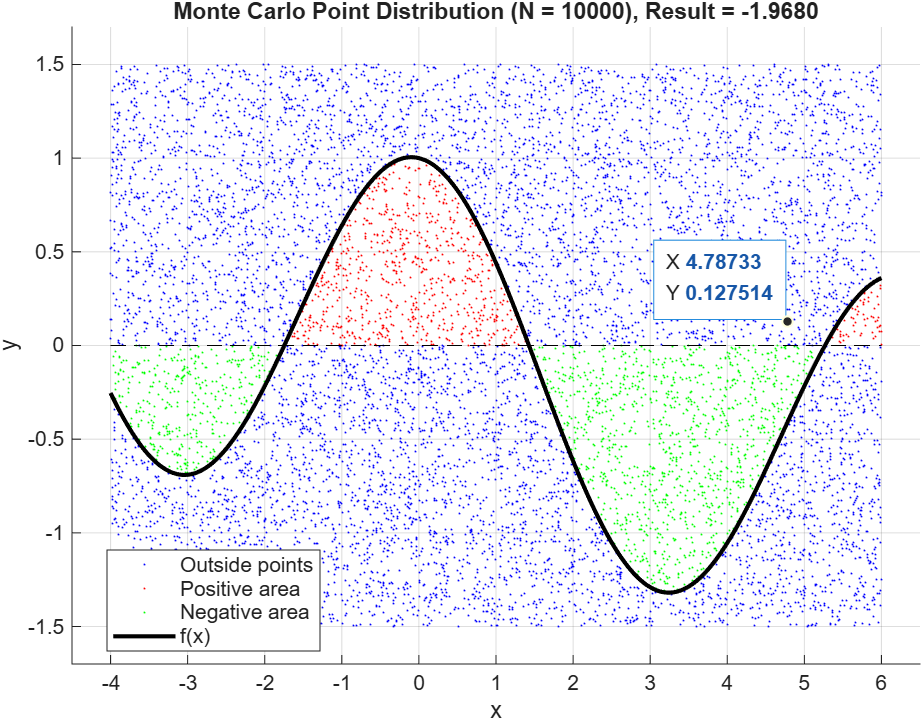
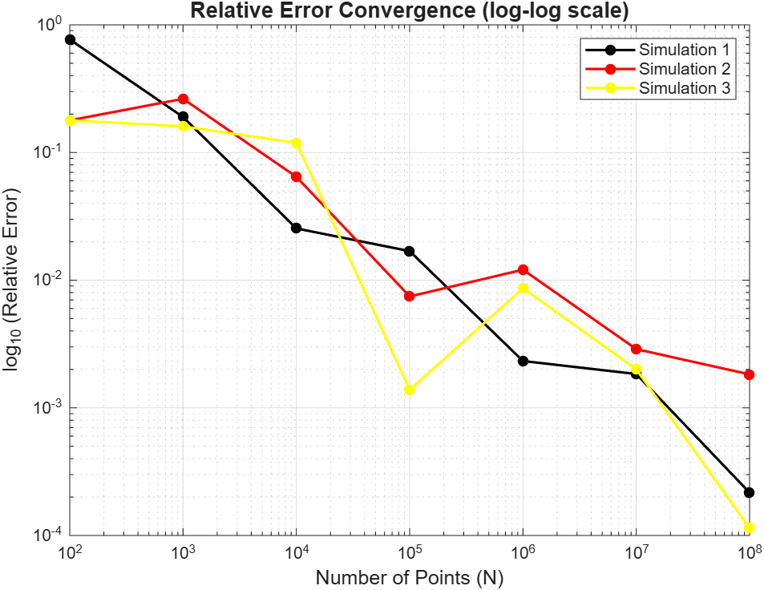

# Numerical Integration Analysis Portfolio in MATLAB

This repository contains MATLAB scripts developed for numerical integration analysis. It serves as a portfolio demonstrating algorithm logic, geometric visualisations, and error convergence analysis for both classical and probabilistic methods.

---

## 📌 Project 1: Monte Carlo Integration (Assignment 1)
This section evaluates the numerical integration of the function $f(x) = \cos(x) - 0.1x$ on the interval $[-4, 6]$ using the probabilistic Monte Carlo method. It is specifically designed to handle functions that take both positive and negative values.

### Methods Implemented
* Monte Carlo Integration with Bounding Box
* Positive and Negative Area Tracking
* Scatter Plot Visualisations for Point Distributions

### 📐 Geometric Visualisation
To understand how the Monte Carlo method approximates the net area under the curve, the script generates geometric visualisations showing the distribution of randomly generated points. 
* **Red markers:** Positive area under the curve
* **Green markers:** Negative area under the curve
* **Blue markers:** Points falling outside the integral area

**Point Distribution (N = 1000):**

**Point Distribution (N = 10000):**

### 📊 Error and Convergence Analysis
This plot demonstrates the probabilistic convergence of the Monte Carlo method. Across 3 different simulations, the relative error consistently decreases proportionally to $1/\sqrt{N}$ as the total number of points increases.

### 🚀 How to Run (Project 1)
Simply open `monte_carlo_integral.m` in MATLAB and run the script. It will output the exact analytical value, a numerical simulation table in the command window, and generate all the visual plots automatically.

---

## 📌 Project 6: Classical Integration Methods (Assignment 6)
This section evaluates the numerical integration of the function $f(x) = x^2 + \sin(5x)$ on the interval $[0, 5]$ using four classical deterministic numerical methods.

### Methods Implemented
* Left-Endpoint Rectangle Rule
* Right-Endpoint Rectangle Rule
* Midpoint Rectangle Rule
* Trapezoidal Rule

### 📐 Geometric Visualisation (n = 5)
To understand how each numerical method approximates the area under the curve, the script generates geometric visualisations for a small number of subintervals ($n=5$).

**1. Left-Endpoint Rectangle Rule:**
This method approximates the integral by constructing rectangles where the height is determined by the function's value at the left edge of each subinterval.

**2. Trapezoidal Rule:**
This method uses trapezoids instead of rectangles, connecting the function values at both the left and right endpoints of each subinterval, which generally provides a better fit to the curve.

### 📊 Error and Convergence Analysis
The project evaluates the accuracy of each method across different subinterval sizes ($n = 10, 50, 100, 1000$).

**3. Error Convergence Comparison (Log-Log Scale):**
This plot demonstrates the convergence order of the methods. As seen below, the Midpoint and Trapezoidal rules exhibit second-order convergence (`O(h^2)`), while the Left- and Right-Endpoint rules show first-order convergence (`O(h)`).

**4. Convergence to the Exact Value:**
This graph illustrates how the numerical approximations from all four methods converge towards the exact analytical integral value (approximately $41.668$) as the number of subintervals increases.

### 🚀 How to Run (Project 6)
Simply open `numerical_integration.m` in MATLAB and run the script. It will output the exact analytical value, a numerical comparison table in the command window, and generate all the visual plots automatically.
